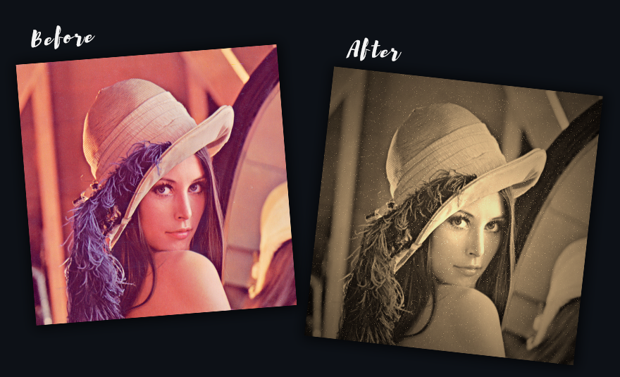
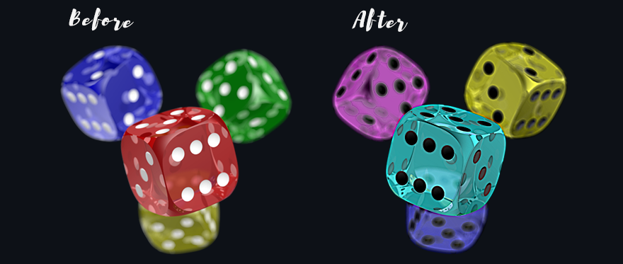
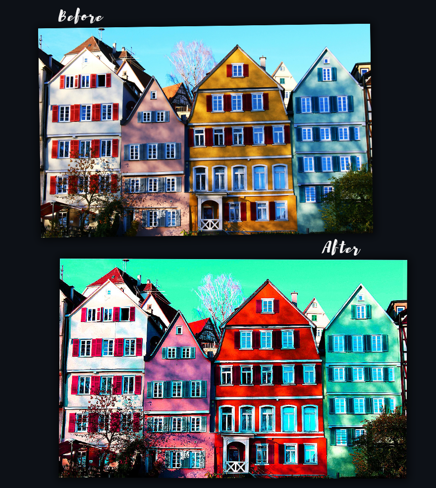

<div align="center">
  

### Photo editing desktop app written in Python with Flet GUI. Utilizes OpenCV and Pillow for image operations

</div>

# Installation
Requirements:

* python==3.11
* flet==0.21.2
* flet_contrib==2024.3.6
* numpy==1.23.5
* opencv_python==4.9.0.80
* Pillow==10.2.0

Installation:

1. Clone the Repository
   
    ```bash
   git clone https://github.com/AgnikAm/PhotoEditor.git
    ```
3. Set Up Virtual Environment (Optional but Recommended)
   
    ```bash
   # Create a virtual environment named 'venv'
    python -m venv venv

    # Activate the virtual environment (Windows)
    venv\Scripts\activate

    # Activate the virtual environment (macOS/Linux)
    source venv/bin/activate
    ```
5. Install Dependencies
   
    ```bash
   pip install -r requirements.txt
    ```
7. Run the game
   
   ```bash
   python src/main.py
    ```

# Features

* **Image management** - load, edit and save images in .png, .jpg and .jpeg formats
* **Editing tools** - versatile tools of various categories:
  * Shape: Rotate, flip and resize your images
  * Sharpness: Sharpen or blur your image
  * Colors: Tune hue, brightness, saturation and contrast for captivating visuals
  * Overlays: Elevate your image with solid or gradient overlays
  * Filters: Try out premade filters
* **Undo and Redo** - Experiment fearlessly with intuitive undo and redo functionality, ensuring that every edit is reversible
* Dynamic contex menus with interactive input such as:
  * input fields
  * sliders
  * radio
  * color picker

# Structure
### Division of Responsibilities:
Logic (functions):

* files_operations.py - Contains file handling functions such as:
  * pick file from system
  * open image
  * create copy
  * update image
  * pick save location
  * save image
  * image history management

* image_operations.py - Contains all image editing functions

Graphical Interface (components):

* buttons.py - class MyButton which contains all buttons used in application
* contex_menu.py - module that assigns and creates an appropriate contex menu for each edit option
* gui_builder.py - class GUIBuilder which creates each interface element and assigns it to the page

Integration:
* app.py - Initializes GUI, constants and essential variables

# Examples
<div align="center">







</div>

# Credits
* [Brusher font by Vlad Cristea](https://www.dafont.com/brusher.font)
* [Camera icon from Flaticon.com](https://www.flaticon.com/free-icons/photography)
* [Example photo 1](https://upload.wikimedia.org/wikipedia/en/7/7d/Lenna_%28test_image%29.png)
* [Example photo 2](https://www.pexels.com/photo/a-woman-in-floral-dress-wearing-a-hat-4075524/)
* [Example photo 3](https://upload.wikimedia.org/wikipedia/commons/4/47/PNG_transparency_demonstration_1.png)
* [Example photo 4](https://www.pexels.com/photo/white-pink-yellow-and-teal-painted-houses-415687/)

